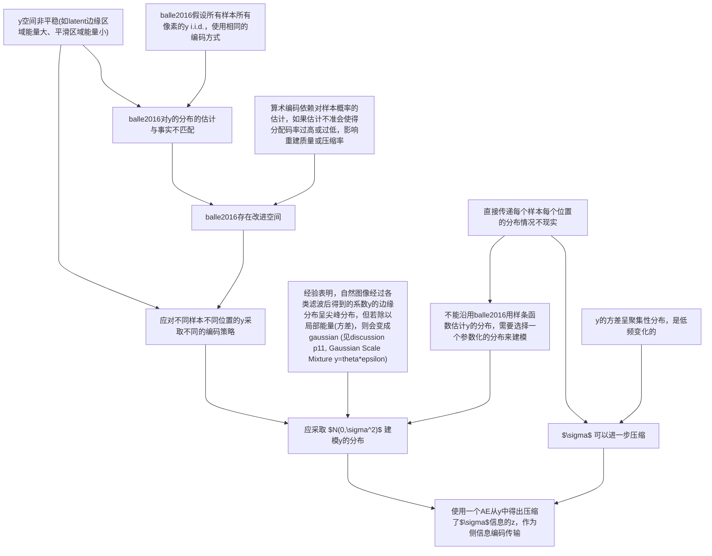


# 深度学习图像压缩综述

图像是一种高维稠密的数据，它的数据量大，含有的语义信息相对较少，有意义的图像分布在一个维度远低于图片大小的流形上。例如，一张全是噪点的图像，和一个绘制了具体内容的图像，它们都是 $\text{Image} \in \mathbb{B}^{C \times H \times W}$，数据量一样，前者的信息熵甚至还更高，但显然，就语义信息而言，噪声对于我们没有意义；一张图像叠加一层频域水印或高频噪声，人眼也往往无法分辨。因此，图像压缩在尽量保留语义信息的前提下能够大幅降低存储与传输开销，让有限的资源服务更多有意义的视觉内容。

传统图像压缩通常依赖固定的算法和先验知识。例如，PNG 基于“相邻的像素相似”这一先验知识。它探测每一行中相邻像素的模式，为各个行从固定的几个选择中挑选一个 filter，决定使用哪些相邻的像素，存储当前像素与这一相邻像素的残差。若对于该图像，“相邻像素相似”这一先验确实成立，则多数码点将分布在 0 周围，且会有大量连续重复码点。因此，可以高效地使用 LZ77 与 Huffman 对该残差编码进行压缩与编码。

JPEG 则主要利用“人眼对亮度更敏感，对色度不敏感”和“人眼对高频图案不敏感”的先验。它先将 RGB 编码的图像转换到 YCbCr，再对 Cb、Cr 通道下采样，压低了色度的解析度。随后将三个通道切分为 $8 \times 8$ 的 patch，每 patch 内做二维 DCT (在 x 轴上每行做一次，产生的特征图再在 y 轴上每行做一次)，产生一张频域强度图。该图左上角是 patch 的基频强度，愈向右向下则愈高频。基于“人眼对高频不敏感”的先验，接下来的 quantization 将这一频域图整除以一个左上角数值较小，右下角数值较大的量化表再取整，从而将大量高频码点置零，便于熵编码工作。

可以看出，传统方法优化的主要途径有：
1. 消除冗余：丢弃对人类和目标任务没有意义的细节，消除数据间的依赖 (JPEG 色度下采样、量化取整丢弃高频, PNG 差分和 LZ77 消除局部空间依赖)；
2. 针对编码做变换：合理利用统计信息或者先验知识，将图像变换到更易于熵编码工作的形式，从而为出现概率不同的模式分配合理长度的编码 (JPEG 的 DCT 和 PNG 的差分，后接 Huffman 编码)。

然而，图像往往具有高度复杂、非线性、长程相关、信息密度空间不均匀的性质。这些传统压缩方法使用固定、线性、人工设计的变换，只在像素级别建模局部、低阶统计关系，使得图像经过传统压缩后依然具有大量空间、通道和语义上的冗余。且依据信息熵公式

$$
H = - \sum p_i log p_i,
$$

欲使平均码长接近于这一下界，必须要建模 $p_i$，即要尽可能准确地估计每种模式出现的概率。消除冗余、估计潜变量的真实分布 (或者运用变分思路，使潜变量逼近一个适合被编码的分布)，深度学习方法正适合这一点。

## balle2016

Balle et al. 提出了一种端到端优化的图像压缩方法[^balle2016endtoend]，是深度学习图像压缩的开山之作。他们借鉴了 JPEG 变换-量化-编码的范式，使用一对小网络 $g_a$, $g_s$ 对图像做非线性变换，取代了传统方法中人工设计的线性变换，呈现一种 AE 的结构: 

$$
y=g_a(x;\phi),\\
\hat{x}=g_s(\hat{y};\theta).
$$

实现端到端图像压缩还需要使量化步骤可微。一种容易想到的方法是重采样取整时的差分，即

$$
\hat{y} = \lfloor y \rceil = y + \mathrm{detach}(\lfloor y \rceil - y),
$$

易知

$$
(\lfloor y \rceil - y) \in (-0.5, 0.5].
$$

作者则使用了更稳健的方法，直接使用一个能够覆盖这一量化间隔的均匀噪声，模拟了量化过程：

$$
\tilde{y} = y + \Delta,\quad \Delta \sim \mathcal{U}(-0.5, 0.5).
$$

此时， $\tilde{y}$ 的分布成为一个以真实量化值 $\hat{y}$ 为中心、宽度为 $1$ 的均匀分布混合体。评估时则直接舍入成 $\hat{y}$，得到离散的隐变量，进行实际的编码与解码。

为了训练这个模型，作者使用了 Rate-Distortion 损失

$$
\begin{aligned}
\mathcal{L} &= R + \lambda D,\\
D &= \mathrm{MSE}(g_p(x), g_p(\hat{x})),\\
R &= -\sum_{i}^{C' H' W'} \log p_{\tilde{y}_i}(\tilde{y}_i) = \mathbb{E}[-\log p_{\tilde{y}}(\tilde{y})] \approx \mathbb{E}[-\log P_{\hat{y}}(\hat{y})] = H(\hat{y}),
\end{aligned}
$$

其中 $D$ 表示失真项，衡量重建图像 $\hat{x}$ 与原始图像 $x$ 的差异。作者意识到直接对 $x$ 和 $\hat{x}$ 取 MSE 可能导致模型学习噪声，且单纯 MSE 不能根据人眼对图像信息的感知能力做取舍，故而提出使用一个 $g_p$ 变换将图像变换到感知空间，再进行 MSE (尽管原文自己的实现直接令 $g_p(x) = x$，仅在 discussion 和插图中进一步讨论)。 $R$ 表示码率项，作者希望最小化 $\hat{y}$ 的平均码长，然而因为 $\hat{y}$ 离散，难以估计，转而使用连续的 $\tilde{y} = \hat{y} + \Delta$ 进行近似。又由于连续概率密度函数 $p_{\tilde{y}_i}$ 未知，因此作者将其参数化为分段线性函数 (线性样条)

$$
p_{\tilde{y}_i}(\tilde{y}_i; \psi_c), \quad i = (b,c,h,w),
$$

与模型同时训练。

此外，文章中还借鉴生理学，引入了 GDN 和 IGDN 学习通道间的促进和抑制作用；以及复刻了 CABAC，实现了一个基于 $p_{\tilde{y}_i}$ 结果的算术编码。这些内容共同组成了一套完整且影响深远的框架。它通过一对可类比为 VAE 的非线性变换加噪声模拟的量化，消除冗余，转换为更易于压缩的隐变量，再对隐变量进行自适应的编码，从而产生具有体积和质量优势的压缩形式。

理想情况下， $g_a$, $g_s$ 是完美的变换，那么隐变量 $y$ 将不存在通道、位置间的依赖，每个 $y_i$ 将表示独立同分布的、纯粹的信息，从而彻底消除冗余。然而，在实际实现中， $g_a$, $g_s$ 必然受到模型归纳偏置的影响，且隐变量 $y$ 依然不完美，各个维度并非独立，依然保留了空间和通道之间的大量依赖。此时若再坚持认为 $\tilde{y}_i$ 各自独立同分布，将它们视为孤立的事件进行编码，将无法取得更好的效果。因此，后续的工作采用了 hyperprior [^balle2018variational], context model [^minnen2018joint], 以及 channel-wise context model [^he2022elic] 等方法来进一步压缩空间、通道、语义上的冗余。

## balle2018

针对这一问题，在 balle2016 的基础上，balle et al. 进一步引入了 hyperprior[^balle2018variational]。核心动机来自一个直接的观察： $g_a$ 产生的隐变量 $y$ 在各位置的能量差异巨大，例如，边缘、纹理区域的响应集中且幅值大，平坦区域的响应稀疏且接近零。即隐变量的方差在空间上是非平稳的，且在粗糙的尺度上呈现低频聚集特征。然而，如前文所述，balle2016 的因子化先验却假设所有位置的 $y$ 独立同分布，这意味着整张图用一种策略去编码。一旦这一假设与真实边缘分布不匹配，则算术编码分配给 $\tilde{y}_i$ 的码字长度就不再是信息意义下的最短码长：对于方差大的区域，模型将大幅值的 $\tilde{y}_i$ 误判为极不可能事件而给予过长的码字；对方差小的区域，又因概率密度估算过宽而产生编码冗余。

因此，一个自然的改进方向是让每个 $\tilde{y}_i$ 拥有一个适配该处统计特征的分布，而不是所有位置共用一个分布。然而，直接传递每个位置的分布参数 (如标准差场 $\sigma \in \mathbb{R}^{B \times H \times W}$) 等于额外传输一整张图，在码率上不可接受。因此需要用一种参数化的分布建模 $\tilde{y}_i$，参数由一段附加的 side information 来动态指定。

为了选取适当的参数化分布，作者借鉴了 Gaussian Scale Mixture (GSM) 经验：无条件分布的重尾性，本质来自局部尺度随机变量的混合。例如自然图像的线性滤波器响应 (如 DCT 的系数) ，虽然呈尖峰、重尾的分布，却可以分解为

$$
y_i = \sigma_i \cdot \epsilon_i,\quad \epsilon_i \sim \mathcal{N}(0,1).
$$

换言之，给定局部方差 $\sigma_i^2$ ， $y_i$ 近似服从零均值高斯 $\mathcal{N}(0,\sigma_i^2)$ ， $\sigma_i$ 越大则分布越扁平，能够容忍较大误差， $\sigma_i$ 越小则分布越尖峰，需更精确地编码。因此，每个 $\tilde{y}_i$ 的分布可以由一个单一的尺度参数 $\sigma_i$ 完全确定。于是，文章将 $\tilde{y}$ 的条件先验地建模为零均值高斯分布：

$$
\begin{aligned}
p_{\tilde y|\tilde z}(\tilde y_i|\tilde z)
&=
p_{(y_i+\Delta_i)|\tilde z}(\tilde y_i|\tilde z) \\
&=
\int
p_{y_i|\tilde z}(t|\tilde z)
p_{\Delta_i}(\tilde y_i-t),dt \\
&=
\int
f_{\mathcal N(0,\hat\sigma_i^2)}(t)
f_{\mathcal U(-0.5,0.5)}(\tilde y_i-t) dt \\
&=
f_{\mathcal N(0,\hat\sigma_i^2)
*
\mathcal U(-0.5,0.5)}
(\tilde y_i).
\end{aligned}
$$

即每个 $\tilde{y}\_i$ 的分布采用高斯密度函数 $f\_{\mathcal{N}(0, \hat{\sigma}\_i^2)}(\cdot)$ 再与量化噪声的均匀密度 $f\_{\mathcal{U}(-0.5,0.5)}(\cdot)$ 的卷积来表征。在编码时， $\hat{y} \in \mathbb{Z}$ ，编码 $\hat{y}\_i$ 码字长度为 $-\log P\_{\hat{y}\_i}(\hat{y}\_i)$ ，其中 

$$
P_{\hat{y}_i}(\hat{y}_i) = \int_{\hat{y}_i-0.5}^{\hat{y}_i+0.5} f_{\mathcal{N}(0, \hat{\sigma}_i^2) * \mathcal{U}(-0.5, 0.5)}(t) dt.
$$

如前文所述，直接编码传递方差 $\sigma$ 显然不现实。恰好，作者注意到 $\sigma$ 的变化是低频聚集性的，相邻像素的 $\sigma_i$ 总是接近。因此，可以将 $\hat{\sigma}$ 视为一个具有较大冗余的方差场，再进一步压缩。于是 balle2018 为 $\hat{\sigma}$ 设计了一个 hyper AE, hyper analysis transform $h_a$ 将 $y$ 作进一步压缩得到超先验 $z$，经过量化、算术编码后作为 side information 录入码流，解码端用 hyper synthesis transform $h_s$ 从 $\hat{z}$ 中上采样重构出 $\hat{\sigma}$。

由于 $z$ 自身没有已知分布，文章沿用了 balle2016 的线性样条估计各个通道的概率密度函数，随整体端到端训练。整体的率失真损失因此包含两项码率：

$$
\mathcal{L}_{R+\lambda D} = \underbrace{\mathbb{E}[-\log_2 p_{\tilde{y}|\tilde{z}}(\tilde{y}|\tilde{z})]}_{\text{rate of } \hat{y}} + \underbrace{\mathbb{E}[-\log_2 p_{\tilde{z}}(\tilde{z})]}_{\text{rate of } \hat{z}} + \lambda \cdot \mathbb{E}[d(x, \hat{x})].
$$

侧信息 $\hat{z}$ 虽然引入了额外的数据量，但换来的先验精度改善使 $\hat{y}$ 的码率大幅降低，端到端训练自动学出的最优平衡使得模型最终取得收益。这一工作通过建模 $\tilde{y}$ 本身的分布，从而更准确地估计 $p_i$，进一步压缩了隐变量在空间上的冗余，也为后续引入 context model 建模局部空间的依赖铺平了道路。

## References

[^balle2016endtoend]: J. Balle, V. Laparra, E. P. Simoncelli, "End-to-end optimized image compression," _arXiv preprint arXiv:1611.01704_, 2016.

[^balle2018variational]: J. Balle, D. Minnen, S. Singh, S.-J. Hwang, N. Johnston, "Variational image compression with a scale hyperprior," _arXiv preprint arXiv:1802.01436_, 2018.

[^minnen2018joint]: D. Minnen, J. Balle, G. Toderici, "Joint autoregressive and hierarchical priors for learned image compression," in _Proc. Adv. Neural Inf. Process. Syst._, vol. 31, 2018.

[^mentzer2020highfidelity]: F. Mentzer, G. Toderici, M. Tschannen, E. Agustsson, "High-fidelity generative image compression," in _Proc. Adv. Neural Inf. Process. Syst._, vol. 31, pp. 11913-11924, 2020.

[^he2021checkerboard]: D. He, Y. Zheng, B. Sun, Y. Wang, H. Qin, "Checkerboard context model for efficient learned image compression," in _Proc. Comput. Vis. Pattern Recognit._, pp. 14771-14780, 2021.

[^he2022elic]: D He, Z Yang, W Peng, R Ma, H Qin, Y Wang, "Elic: efficient learned image compression with unevenly grouped space-channel contextual adaptive coding," in _Proc. Comput. Vis. Pattern Recognit._, pp. 5718-5727, 2022.

